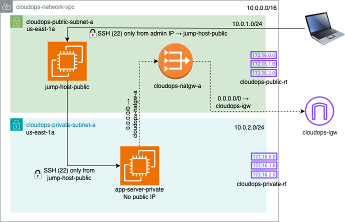

# AWS VPC Networking: Public/Private Subnets with Bastion Host and NAT Gateway

> **Tools Used**: Terraform (Infrastructure as Code), AWS VPC, EC2, Security Groups, NAT Gateway, Internet Gateway

## Project Overview

This project demonstrates how to build a secure, production-grade network environment in AWS using a custom VPC, public and private subnets, EC2 instances, and NAT Gateway. The goal is to restrict direct internet access to internal resources while still enabling outbound access and remote administration using a Bastion (Jump) Host.

---

## Objectives

- Create a custom VPC with CIDR block `10.0.0.0/16`
- Deploy:
  - Public Subnet: `10.0.1.0/24`
  - Private Subnet: `10.0.2.0/24`
- Configure:
  - Internet Gateway (IGW) for outbound access from public subnet
  - NAT Gateway to allow private subnet to reach the internet (but not be reached directly)
  - Bastion (Jump) Host in public subnet
  - Private EC2 instance accessible only through the Bastion Host
- Secure all resources using appropriate routing tables and security groups

---

## 🧭 Architecture Diagram



> Diagram includes:
> - `cloudops-network-vpc`
> - `cloudops-public-subnet-a` and `cloudops-private-subnet-a`
> - IGW, NAT Gateway
> - Bastion Host (public EC2)
> - App Server (private EC2)

---

## Components and Naming Conventions

| Component | Name |
|----------|------|
| VPC | `cloudops-network-vpc` |
| Public Subnet | `cloudops-public-subnet-a` |
| Private Subnet | `cloudops-private-subnet-a` |
| Internet Gateway | `cloudops-igw` |
| NAT Gateway | `cloudops-natgw-a` |
| Public EC2 (Jump Host) | `jump-host-public` |
| Private EC2 (App Server) | `app-server-private` |
| Route Tables | `cloudops-public-rt`, `cloudops-private-rt` |

---

## Setup Instructions (Console)

1. **Create VPC**: `10.0.0.0/16`
2. **Create Subnets**:
   - Public: `10.0.1.0/24`
   - Private: `10.0.2.0/24`
3. **Create and attach Internet Gateway**: `cloudops-igw`
4. **Create NAT Gateway** in public subnet and allocate Elastic IP
5. **Update Route Tables**:
   - Public: `0.0.0.0/0` → IGW
   - Private: `0.0.0.0/0` → NAT Gateway
6. **Launch EC2 instances**:
   - `jump-host-public`: public subnet, public IP, SSH open to your IP
   - `app-server-private`: private subnet, no public IP, allow SSH only from Bastion's private IP

---

## Security Groups

### Bastion Host:
- Allow SSH (port 22) from your laptop IP

### Private EC2:
- Allow SSH (port 22) only from **Bastion Host’s private IP**

---

## SSH Access Workflow

### Step 1: SSH from Local → Jump Host

ssh -i ~/MyKeyPair.pem ec2-user@<jump-host-public_ip>

### Step 2: SSH from Bastion Host to the Private EC2

On the bastion (jump) host:

1. Ensure the private key is present and secured:
   ```bash
   chmod 400 ~/MyKeyPair.pem

ssh -i ~/MyKeyPair.pem ec2-user@<app_private_ip>
